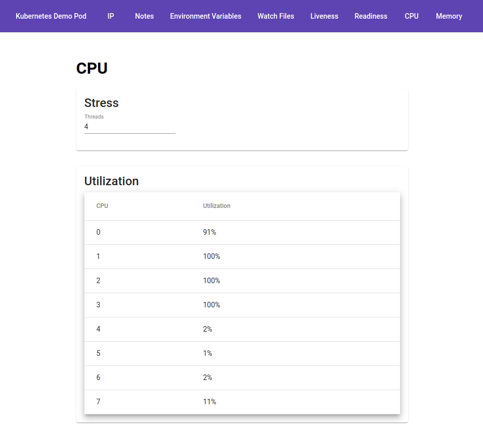

# Kubernetes Demo Pod

This application provides some useful features to demonstrate certain aspects of Pods inside a Kubernetes cluster.



## Run

```bash
$ docker run -it --rm -p 8080:8080 psanetra/demo-pod:latest
```

## Features

* Delay startup (via `--startup-delay` option)
* Save state in a volume
* Read state from a volume
* Show environment variables
* Show changing ConfigMap values via `--watch` option (if supported)
* Show changing Secret values via `--watch` option (if supported)
* Control liveness
* Control readiness
* Control cpu utilization
* Control memory utilization
* Show available and used memory
* Show client IP
* Show Pod IPs
* Show request http headers behind ingress controller
